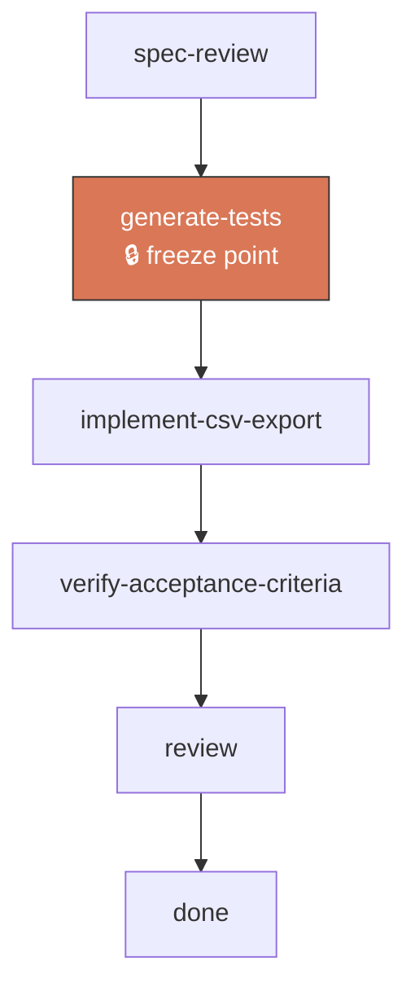
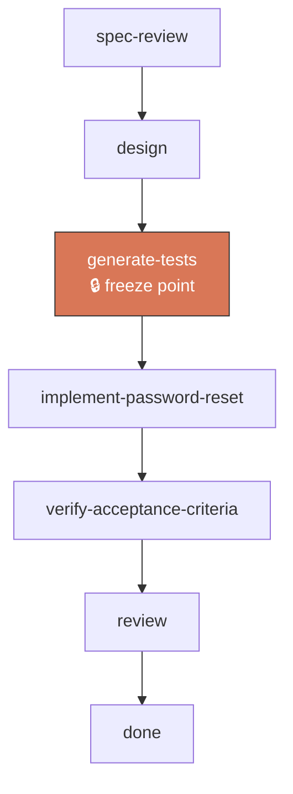

# kestra-build 🤨

Give it a feature spec. It hands back a complete stage-by-stage plan (`workflow.yaml` + `state.json`) — who writes what, when tests freeze, what counts as done. It doesn't run the plan, just describes it.

The workflow it creates gets handed to [`kestra-run`](../kestra-run/README.md) (the executor). kestra-build's job ends at the YAML file.

## What you get

**`workflow.yaml`** — a stage-by-stage plan custom to your feature. Each stage says:
- What paths it can write (its boundary)
- How to check if it passed (command or artifact)
- What to do if it fails (retry or escalate)
- One special stage marks where tests freeze (lock them in, can't change them later)

**`state.json`** — the initial state: all stages waiting, test hash empty, ready to run.

## What kestra-build doesn't do

It doesn't run the plan, write code, or commit anything. Think of it as a *blueprint* writer, not a builder.

- Want to run the plan? Use [`kestra-run`](../kestra-run/README.md) after.
- Want to build a feature right now without generating a workflow file? Chain whatever
  specialized spec/plan/build/review skills or agents you already have directly instead.

## How to use

Just ask for a workflow from a spec you already have:

```
"turn workflows/runs/csv-export/0-spec.md into a workflow.yaml"
```

kestra-build then:

1. Reads the acceptance criteria from your spec (or asks you to sharpen a rough ask first)
2. Figures out what stages you actually need — no fixed checklist, it adapts to your spec
3. Writes `workflow.yaml` + `state.json` next to the spec and explains the stage flow in plain language

You review it once before treating it as frozen.

For the CSV-export example above (no UI, so no design stage), that sequence is:



Every stage after the freeze point is forbidden from touching test paths — enforced against the
diff, not by asking the stage nicely. `review` (suggesting whatever code-review and security-review
skills you have) is unconditional — passing tests only prove the spec's own acceptance criteria, not
code quality or security holes the spec never thought to test for. A spec with a devops-relevant
flag (env vars, migrations, feature flags) also picks up a `deploy-readiness` stage (suggesting
whatever devops skill you have) between `review` and `done` — omitted here since csv-export has none.

None of these stages stop for a human by default — `spec-review` is a mechanical spec-sanity
check, `review` greps an automated verdict artifact and gives the implementation stage a bounded
number of attempts to address any findings, and `done` just writes a completion summary once
everything upstream passed. The one place a human is always in the loop is `fixing → reworking`,
same as before — see [`references/design-principles.md`](references/design-principles.md)'s
"Default HITL posture." Want an explicit sign-off somewhere anyway (e.g. before a risky prod
deploy)? Say so and kestra-build will add a `human_approval` stage for that specific checkpoint.

A UI-facing feature (say, a password-reset flow sharpened from a rough prose ask) picks up an
extra `design` stage that has to land *before* the freeze point:



The full generated YAML for both examples — every field filled in — is in
[`references/workflow-schema.md`](references/workflow-schema.md#worked-example).

## How it works when you run it

kestra-build just writes the file, but here's what happens when [`kestra-run`](../kestra-run/README.md) executes it:

**Each stage runs once, then gets checked:**
- Does it meet its `exit_criteria`? (a test passes, a command succeeds, an artifact exists — or, for a `human_approval` stage a user explicitly asked for, a human approves)
- Did it stay inside its `write_scope`? (didn't touch paths it shouldn't)

**If a stage fails**, it retries up to `max_attempts` times, only touching paths in `write_scope` (or, for a `write_scope: []` stage like `review`, in its `on_fail.target`'s `write_scope`). If it keeps failing or produces the same diff twice, it escalates to `reworking` — the system admitting the frozen spec/tests might be wrong, not blaming the code. That escalation is the one point that always stops for a human — see [`references/design-principles.md`](references/design-principles.md)'s "Default HITL posture."

**Once tests freeze**, no stage after that point can touch test files. The orchestrator enforces this by checking the diff, not by asking nicely.

**Every stage that passes gets committed** — no git tags, just a commit message identifying the stage id, so you can roll back (`git reset` to that commit's SHA) or resume from anywhere.

**The default template has no `waiting_approval` stage** — it ends with `done`, a mechanical stage that writes a completion summary once everything upstream passed. `human_approval` still exists as an `exit_criteria` type for when a user explicitly wants a manual milestone, but kestra-build no longer adds one by default.

## Dry-run before you see it

Before showing you the generated files, kestra-build runs a zero-dependency structural check:

```
python3 scripts/validate_workflow.py <output-dir>
```

Pure Python, no PyYAML — parses just the constrained YAML subset kestra-build itself emits. It's a
mechanical graph/set check, the same standard kestra-run's own enforcement holds itself to, just
applied before the first stage ever runs, not after.

**Why this matters:** the `workflow.yaml` this generates is always syntactically valid YAML — the
bugs that matter here aren't typos, they're an AI writing several *related* fields (a stage's
`write_scope`, another stage's `on_fail.target`, the one `freeze_after` flag) that individually
look fine but don't actually agree with each other. A quick benchmark on a two-component spec
(backend + frontend) confirmed this concretely: the pre-validator version of kestra-build shipped a
`deploy-readiness` stage with `write_scope: []` and `on_fail.action: fixing` but no `target` — if
that stage ever failed during a real `kestra-run`, the orchestrator would have had nowhere to apply a
fix. Nothing about that file looked wrong on a read-through; it only breaks once you check the
`on_fail` fields across every stage against each other. Concretely, the checker catches:

- **Missing fix target** — a `write_scope: []` stage (`review`, `verify`, `deploy-readiness`) with
  `on_fail.action: fixing` but no `target` naming another stage to apply the fix to.
- **Frozen-test leakage** — any stage's `write_scope` (other than the freeze stage or `reworking`)
  overlapping the paths that were frozen at test-generation time.
- **Parallel write collisions** — two stages with no dependency ordering between them (so kestra-run
  might run them concurrently) whose `write_scope`s overlap.
- **Broken freeze invariant** — zero or more than one stage with `freeze_after: true` (there must
  be exactly one, or the test-hash mechanism has nothing to snapshot, or snapshots the wrong
  thing).
- **Dead or unreachable stages** — a dependency cycle, or a stage with no path back to any
  `depends_on: []` start stage.
- **Malformed exit checks** — `exit_criteria` missing the `run` command or `artifact` path its
  declared `type` requires, or a `fixing` block missing `max_attempts`/`escalate_at`.
- **state.json drift** — stage ids in `state.json` that don't match `workflow.yaml`, or a
  non-null `test_hash` at the initial state.

`FAIL` blocks — kestra-build fixes the stage list and re-runs before showing you anything. `WARN` is
surfaced to you but isn't a blocker (the checker is deliberately conservative and can over-flag,
e.g. a plausible write_scope overlap that's actually fine in practice).

**The tradeoff:** this costs real overhead — the same benchmark measured roughly 70% more wall-clock
time and 18% more tokens on the run that had to dry-run and fix, versus the one that didn't check
at all. That cost is paid once, at generation time, in exchange for not discovering the same bug
later mid-`kestra-run`, where it's harder to diagnose and more expensive to unwind.

For the full reasoning behind why each field exists and what failure modes it prevents, see [`references/design-principles.md`](references/design-principles.md). Full field reference in [`references/workflow-schema.md`](references/workflow-schema.md).
