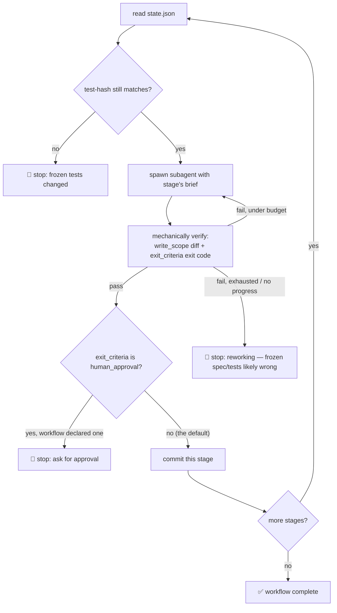

# kestra-run 🏃

Give it a workflow from [`kestra-build`](../kestra-build/README.md), and it runs it — spawns an agent to do each stage, checks the result using real commands (not guessing), commits what passes, and stops when something needs your call.



## The key insight

Every check (test-hash still valid? write_scope respected? exit_criteria passed?) is a **real command that actually runs** — not kestra-run looking at a diff and deciding. That's why an AI orchestrator is safe here: the decisions that matter are mechanical. For the exact commands, see [`references/enforcement.md`](references/enforcement.md).

Judgment-requiring stages (spec sanity, review, security) aren't exceptions to this — `review` writes a `VERDICT: CLEAR`/`VERDICT: CHANGES_REQUESTED` artifact, and `exit_criteria` greps that artifact for a real exit code. A `CHANGES_REQUESTED` verdict isn't a stop; it's a normal `fixing` failure that gives the implementation stage (via `on_fail.target`) a bounded number of attempts to address it, same as a failing test.

## When it stops

- **`fixing` → `reworking`** — tried max attempts or same failure repeated (or a review/security finding a bounded fix loop couldn't resolve); frozen spec/tests might be wrong. This is the one stop condition every generated workflow has, guaranteed — see kestra-build's "Default HITL posture."
- **`blocked`** — terminal, someone needs to unblock it
- **Test-hash mismatch** — someone changed the frozen tests outside the process
- **`human_approval`** — only if this particular workflow explicitly declared one (opt-in, not the default; see [`kestra-build`](../kestra-build/README.md))

Everything else runs automatically. It doesn't ask for confirmation after every stage — that would just be running it by hand.

## How to use

Point it at a feature that already has `workflow.yaml` + `state.json`:

```
/kestra-run csv-export
"run the workflow for inventory-sync"
"resume where csv-export left off"
```

No workflow yet? It'll tell you to run `kestra-build` first — it doesn't improvise.

## Resuming

`state.json` and the commit from the last passing stage already know where you stopped (no git tags — the commit itself is the checkpoint). Just ask kestra-run to continue — it picks up where it left off.

Full orchestration logic in [`SKILL.md`](SKILL.md); exact commands used for checking in [`references/enforcement.md`](references/enforcement.md).
