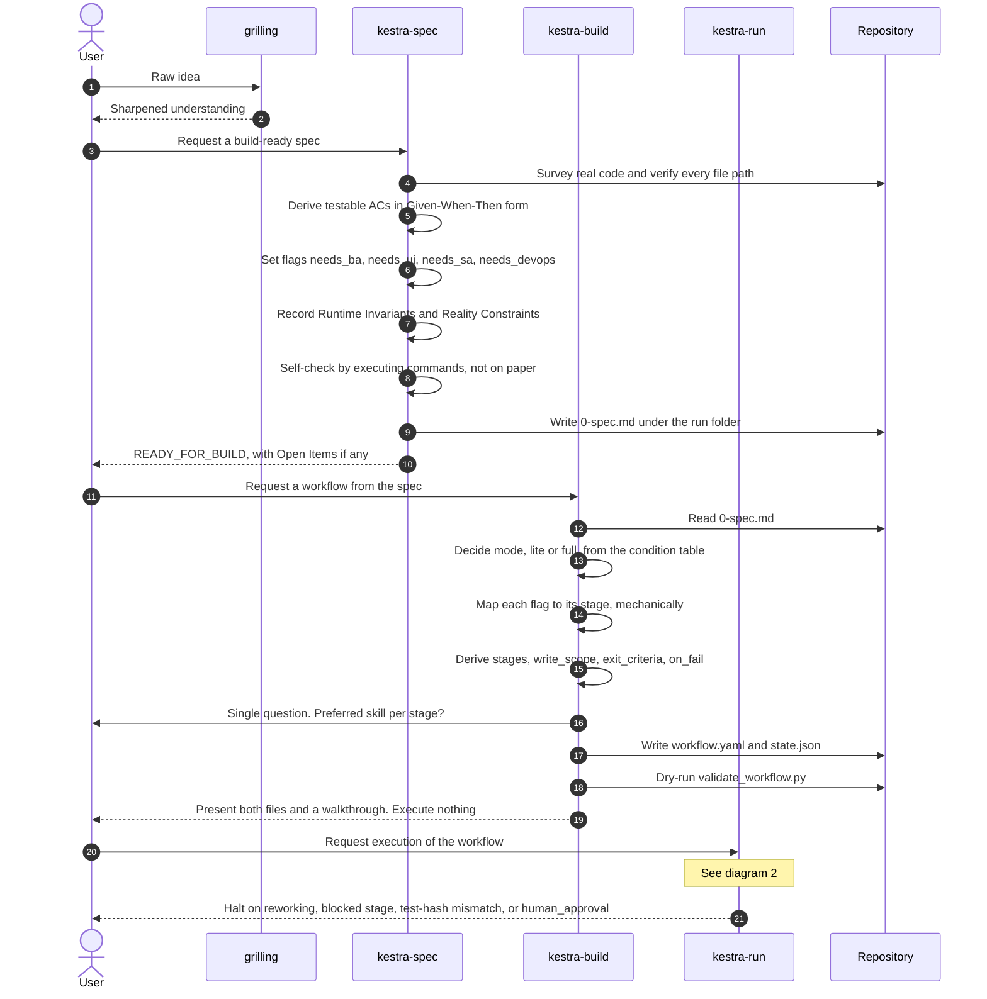
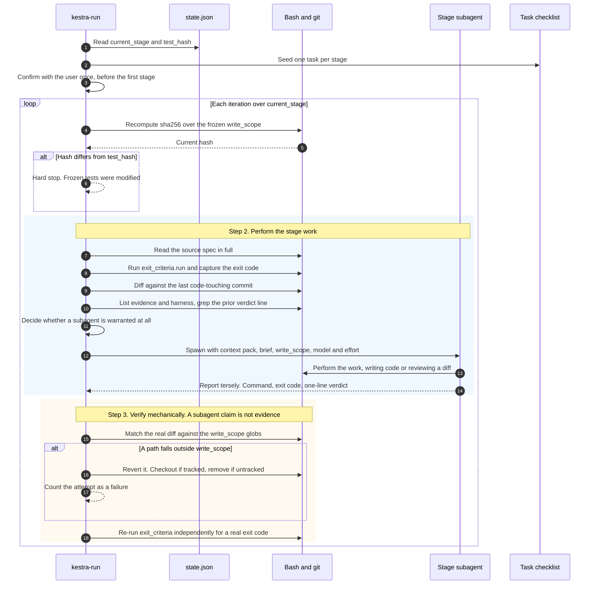
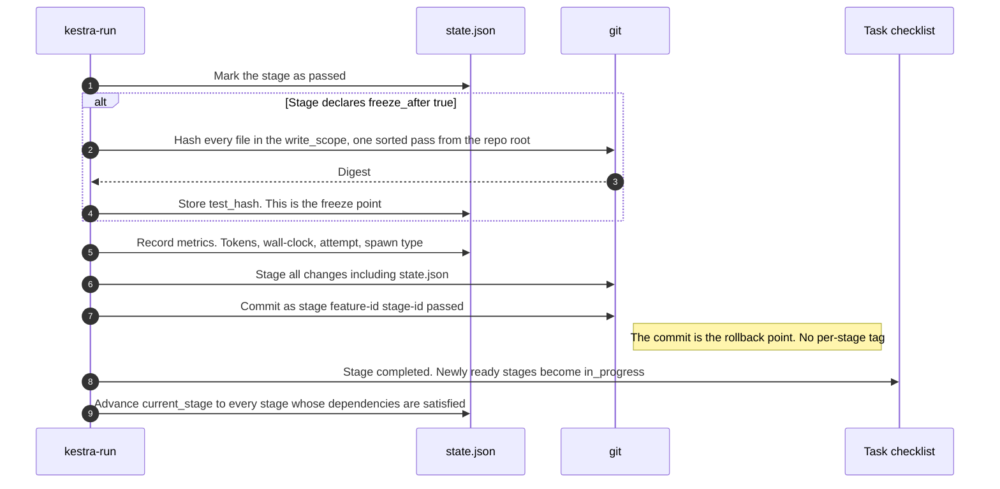
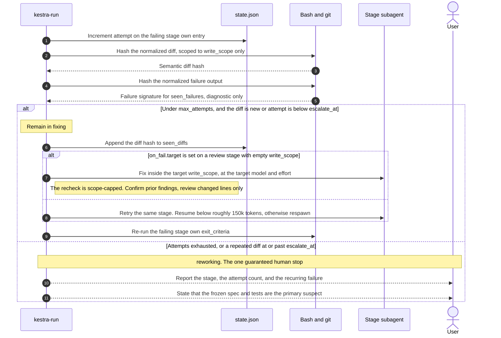
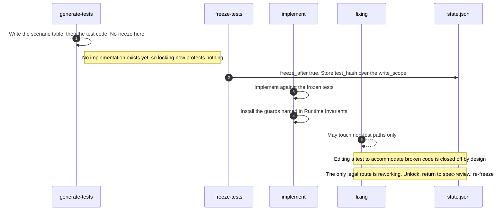

# Kestra — Sequence Diagrams

Reference diagrams for the `kestra-spec` → `kestra-build` → `kestra-run` pipeline.

## 1. Overview: idea to spec to workflow to execution

## 2. kestra-run, the main loop, per stage

## 3. On pass, freeze and commit

## 4. On fail, fixing and escalation to reworking

## 5. The three primitives that make the freeze real

